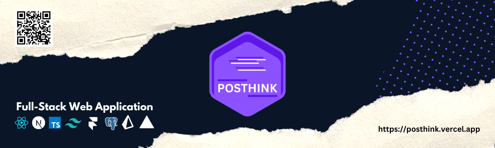

# posthink-project

## This full-stack web application is an attempt in diving a bit deeper into full-stack web development with ReactJS, NextJS, TypeScript, TailwindCSS, Framer-Motion, PostgreSQL, Prisma and Vercel. 

With this web application you will be able to create and delete posts as well as commenting on other people&apos;s posts.

---

 
<h2>View <a href="https://posthink.vercel.app" target="_blank"><strong>Demo</strong></a></h2>
 

---

<h1><a href="https://posthink.vercel.app" target="_blank"><strong>POSTHINK</strong></a></h1>

 